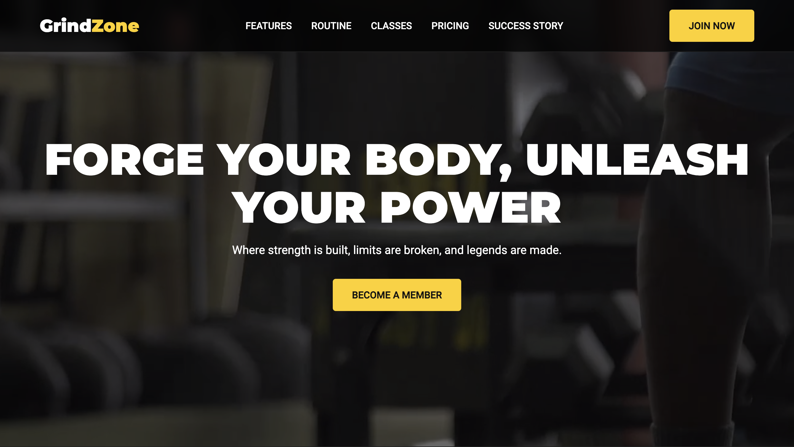

# GrindZone Gym - Fictional Gym Landing Page



Welcome to **GrindZone Gym**, a fully responsive, modern landing page for a fictional fitness center.  
This project showcases a gym's features, classes, pricing, and success stories to attract new members.  
It's built with **pure HTML and CSS**, focusing on modern design principles like **Flexbox, Grid**, and a dynamic **video hero section**.

➡️ **[View Live Demo](https://iamamanrajdev.github.io/Css-Project/gym2/)**

---

## ✨ Features

- 🎥 **Hero Section with Video Background** → Engaging, full-screen video to capture attention.  
- 🏋️ **Modern Equipment & Features** → Clean grid layout highlighting key selling points.  
- 📅 **Weekly Workout Plan** → Visual, CSS Grid-based routine section.  
- 🧘 **Signature Classes Showcase** → Image-driven section displaying classes offered.  
- 💰 **Tiered Pricing Plans** → Three-column pricing table with "Most Popular" highlight.  
- 🌟 **Success Story/Testimonial** → Before-and-after transformation to inspire clients.  
- 📩 **Functional Contact Form** → Integrated with Formspree (no backend required).  
- 📱 **Fully Responsive Design** → Seamlessly adapts to all devices.  
- 🖱️ **Smooth Scrolling** → Enhanced navigation experience.  
- 🎨 **Font Awesome Icons** → Crisp, scalable vector icons.  

---

## 🛠️ Technologies Used

- **HTML5** → Semantic and well-structured markup  
- **CSS3** → Flexbox, Grid, Transitions, Animations, Media Queries  
- **Custom Properties (CSS Variables)** → For easy theming  
- **Formspree** → Contact form handling  
- **Google Fonts** → Montserrat (headings), Roboto (body)  
- **Font Awesome** → Modern icons  

---

## 🚀 Getting Started

To run this project locally:

```bash
# Clone the repository
git clone https://github.com/iamamanrajdev/Css-Project.git

# Navigate to the project folder
cd Css-Project/gym2

# Open in browser
open index.html   # (or just double click index.html)

📁 Project Structure
grindzone-gym/
├── index.html          # Main HTML file
├── style.css           # All project styles
├── README.md           # Documentation
├── screenshot.png      # Project preview image
└── assets/             # Images & videos
    ├── 4746006-uhd_3840_2160_25fps.mp4
    ├── gymbefore.jpeg
    ├── gymafter.jpeg
    ├── ge1.png
    ├── geyoga.png
    ├── boxing.png


🔧 Configuration

📩 Contact Form
The enquiry form uses Formspree.
Update the action attribute with your unique Formspree URL in index.html:
<form action="https://formspree.io/f/your-unique-id" method="POST" class="enquiry-form">
  ...
</form>
⚠️ Without updating this, the contact form will not work.

🌐 Social Media Links

Update the footer social icons in index.html with your personal links:
<div class="social-icons">
  <a href="https://github.com/iamamanrajdev"><i class="fab fa-github"></i></a>
  <a href="https://www.linkedin.com/in/aman-raj-0a58482b3/"><i class="fab fa-linkedin"></i></a>
  <a href="mailto:iamamanraj.dev@gmail.com"><i class="fas fa-envelope"></i></a>
</div>

✍️ Author

Created with ❤️ by Aman Raj  

- 🌐 [GitHub](https://github.com/iamamanrajdev)  
- 💼 [LinkedIn](https://www.linkedin.com/in/aman-raj-0a58482b3/)  
⸻
📄 License

This project is open-source and available under the MIT License.
